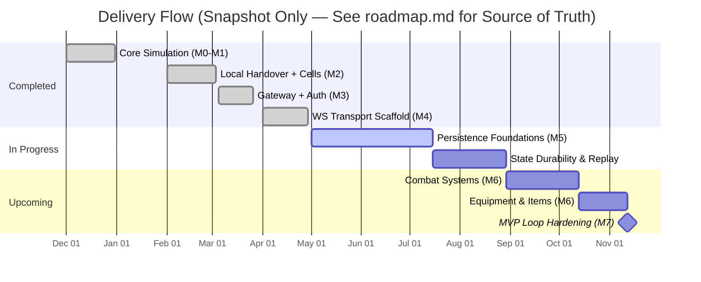

# prototype-game

A server-authoritative multiplayer simulation backend featuring:
- Seamless local instancing / spatial cell handover (foundation for "server meshing")
- Deterministic tick loop driving world simulation
- Gateway ↔ Simulation process separation (bootstrapping, auth, routing hints)
- Optional real-time WebSocket transport (activated via `ws` build tag)
- Roadmap toward persistence, combat, equipment, and a full MVP game loop

> Canonical milestone & risk source: [docs/product/roadmap/roadmap.md](docs/product/roadmap/roadmap.md)

Last Updated: 2025-09-18

---

<!-- ai-index
version: 0.1
project: prototype-game
status_date: 2025-09-18
areas:
  simulation_core: complete
  gateway_auth: baseline
  websocket_transport: scaffold
  persistence: in_progress
  combat: upcoming
  equipment: upcoming
  documentation: ongoing
  automation: ongoing
risk_level: prototype
note: Refer to docs/product/roadmap/roadmap.md for authoritative, frequently updated plan.
-->

## 🚦 Project Status Snapshot

| Area | Phase | State | Notes |
|------|-------|-------|-------|
| Simulation core | M0–M2 | Complete (production) | Cell math + local handover logic functional |
| Gateway auth/session | M3 | Complete | Token issuance + validation endpoints |
| WebSocket transport | M4 | Complete | Full JSON protocol with resume capabilities |
| Persistence | M5 | Complete | PostgreSQL with optimistic locking |
| Equipment systems | M6 | Complete | Slots, cooldowns, skill requirements, encumbrance |
| Inventory & skills | M7 | Complete | Multi-compartment inventory, skill progression |
| Client enablement | M8 | In Progress | WebSocket equipment operations needed |
| Visual client | M9 | Upcoming | Unity/Godot prototype planned |
| Tooling & automation | Ongoing | Active | Make targets + scripts evolving |
| Documentation & governance | Ongoing | Structured | ADR process + role/session guides |

Update this table in lockstep with roadmap.md to avoid drift.

---

## 📈 Roadmap (Snapshot Excerpt)
For full detail (risks, dependencies, acceptance criteria) consult: [docs/product/roadmap/roadmap.md](docs/product/roadmap/roadmap.md)


---

## 🔗 Quick Links
- 📊 **Roadmap**: [docs/product/roadmap/roadmap.md](docs/product/roadmap/roadmap.md)
- 🛠️ **Implementation Guide (M5–M7)**: [docs/product/roadmap/implementation-playbook.md](docs/product/roadmap/implementation-playbook.md)
- 🎯 **Project Board**: [GitHub Project #2](https://github.com/users/AstroSteveo/projects/2)
- 🧪 **Developer Guide**: [docs/development/developer-guide.md](docs/development/developer-guide.md)
- 🧭 **Technical Design Doc**: [docs/architecture/technical-design-document.md](docs/architecture/technical-design-document.md)
- 🗂️ **Game Design / Vision**: [docs/product/vision/game-design-document.md](docs/product/vision/game-design-document.md)
- 📝 **Latest Roadmap Meeting Outcomes**: [Issue #109](https://github.com/AstroSteveo/prototype-game/issues/109)
- 🧬 **ADRs**: [docs/process/adr/](docs/process/adr/)
- 🤖 **Copilot / Agent Guidance**: [.github/copilot-instructions.md](.github/copilot-instructions.md)
- 📋 **Project Analysis**: [docs/analysis/](docs/analysis/) - Comprehensive system analysis and discovery
- 🎯 **Next Steps**: [docs/product/roadmap/next-steps-analysis.md](docs/product/roadmap/next-steps-analysis.md)

---

## 🧪 Architecture Overview
```
[Client]
   |  (HTTP auth bootstrap + WebSocket real-time)
   v
[ Gateway ]  -- health, login, validate, sim selection
   |
   v
[ Simulation Process(es) ]
   - Tick loop (deterministic)
   - Spatial cell partitioning & handover
   - Entity state transitions
   - (Planned) persistence adapters (snapshot + journal)
```
Planned extensions: persistence integration, combat pipeline, equipment systems, observability (metrics & structured events), replay validation.

---

## 🧩 Feature Matrix
| Capability | Status | Build Tag / Flag | Notes |
|------------|--------|------------------|-------|
| Tick-based simulation | Prototype | n/a | Deterministic loop |
| Spatial cell handover | Prototype | n/a | Local instance only |
| Gateway auth + tokens | Baseline | n/a | Dev-only security |
| WebSocket transport | Scaffold | `ws` | Minimal JSON handshake |
| Persistence layer | In Progress | n/a | Schema + durability design |
| Combat system | Upcoming | n/a | Depends on persistence |
| Equipment/items | Upcoming | n/a | Data modeling pending |
| Observability metrics | Planned | n/a | Roadmap M7+ |

---

## 🚀 Quick Start (Local Dev)
Using Make (preferred):
```bash
make run     # starts simulation (ws enabled) + gateway
make login   # issues a dev token and prints it
```
Manual:
```bash
cd backend
# Simulation (with WebSocket)
go run -tags ws ./cmd/sim --port 8081
# Gateway
go run ./cmd/gateway --port 8080 --sim localhost:8081
# Health
curl localhost:8081/healthz
curl localhost:8080/healthz
# Login & validate
curl 'http://localhost:8080/login?name=Test'
curl 'http://localhost:8080/validate?token=<token>'
```
Planned container workflow (placeholder—add Dockerfile / compose before using):
```bash
docker compose up --build
```

---

## 🌐 WebSocket Protocol (Current Minimal Form)
1. Acquire token via `GET /login?name=`
2. Connect: `ws://`
3. First client frame (auth):
   ```json
   {"token":"<issued-token>"}
   ```
4. Server response:
   - Success: `{"type":"join_ack","data":{...}}`
   - Failure: `{"type":"error","code":"auth_failed","message":"..."}`
Protocol will expand with: state deltas, movement/action submission, debug streams. Treat current shape as unstable.

---

## 🧱 Persistence (M5 – In Progress)
Objectives: durable entity/world state, snapshot + journal replay, deterministic recovery, schema versioning. See roadmap for acceptance criteria.

## ⚔️ Combat & Equipment (M6 – Upcoming)
Planned: authoritative action resolution, component-based stats, deterministic ordering, replay validation. Designs remain provisional.

---

## 🛠️ Development Workflow
- Tests: `make test`
- (If configured) lint/format: `make lint`
- Propose significant changes with an ADR (see [docs/process/adr/](docs/process/adr/))
- Large feature? Start with [Feature Proposal](docs/process/FEATURE_PROPOSAL.md)

---

## 🤝 Contributing Guidelines
1. Review active milestone issues (Project Board)
2. Confirm acceptance criteria BEFORE coding
3. Add/modify ADRs for architectural shifts
4. Keep PRs focused; reference related issues
5. Include test coverage for new logic

---

## 🗺️ Planning & Governance Resources
- Roadmap meeting template: [docs/process/sessions/ROADMAP.md](docs/process/sessions/ROADMAP.md)
- Role definitions: [docs/process/roles.md](docs/process/roles.md)
- Session guides (planning, decisions, retros): [docs/process/sessions/](docs/process/sessions/)

---

## 🧪 Testing Strategy (Roadmap Evolution)
Layers (current + planned):
- Unit & tick determinism tests
- Handover boundary tests
- Load/perf harness (post-persistence)
- Replay integrity validation (persistence)

---

## 🤖 LLM / Automation Notes
Designed to be machine-parsable:
- `ai-index` comment: stable keys for agents
- Clearly delimited sections; titles should NOT be reworded by tooling
- Avoid inferring implementation completeness beyond stated tables
Automation contributors: follow `.github/copilot-instructions.md` and governance docs.

---

## ⚠️ Prototype Disclaimer
Security, auth, persistence, and network protocol are NOT production-grade. Expect breaking changes until explicit stabilization (post-M7).

---

## 📄 License
Add or reference a LICENSE file (none detected at time of this update). Consider adding one to clarify usage rights.

---

## 🔄 Maintenance Guidance
When updating this README:
- Keep `ai-index` synchronized with roadmap.md
- Update date stamp (UTC) at top
- Remove deprecated sections instead of leaving stale content
- Validate internal links after structural repo changes

---
