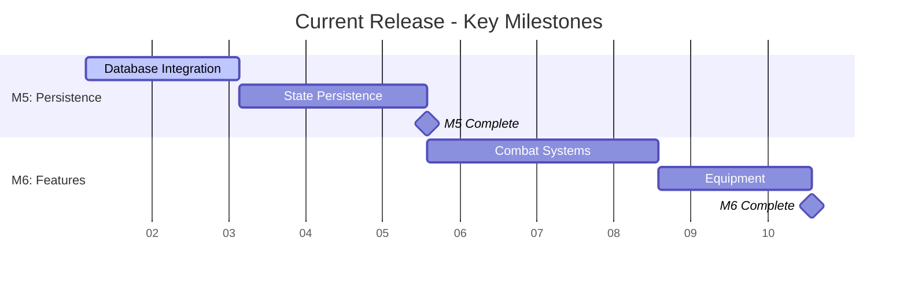

# prototype-game

A multiplayer game backend with seamless local instancing (server meshing), real-time WebSocket communication, and server-authoritative simulation. Built in Go with comprehensive testing and automated CI/CD.

## 📈 Roadmap Visualization

### Current Release Timeline

### Quick Links
- 📊 **[Detailed Roadmap](docs/roadmap/ROADMAP.md)** — Updated Sept 2025 with "Full MVP Loop and Persistence" timeline
- 🛠️ **[Implementation Guide](docs/dev/ROADMAP_IMPLEMENTATION.md)** — Technical requirements for M5-M7 features
- 🎯 **[GitHub Project Board](https://github.com/users/AstroSteveo/projects/2)** — Live project tracking
- 📋 **[Roadmap Planning Guide](docs/process/ROADMAP_MEETINGS.md)** — How to participate in roadmap discussions
- 📝 **[Issue #109](https://github.com/AstroSteveo/prototype-game/issues/109)** — Latest roadmap planning meeting outcomes

### How to Use the Roadmap
**For Contributors:**
1. Check [current milestone status](docs/roadmap/ROADMAP.md#-status-snapshot-by-area) to see what areas need work
2. Review [milestone acceptance criteria](docs/architecture/technical-design-document.md#mvp-milestones--acceptance-criteria) before starting work
3. Follow the [developer guide](docs/development/developer-guide.md) for build/test procedures

**For Project Planning:**
- Use the [roadmap meeting template](docs/process/sessions/ROADMAP.md) for quarterly planning
- Reference [risk assessments](docs/roadmap/ROADMAP.md#️-risks-and-mitigations) for decision making
- Track progress via the [status dashboard](docs/roadmap/ROADMAP.md#-status-snapshot-by-area)

## 📚 Documentation

### Design & Architecture
- `docs/product/vision/game-design-document.md` — Game Design Document (vision, player experience, scope)
- `docs/architecture/technical-design-document.md` — Technical Design Document (architecture, sharding plan, milestones)
- `docs/roadmap/ROADMAP.md` — Project roadmap with detailed visualizations

### Development & Process
- `docs/development/developer-guide.md` — Developer Guide (build, run, tests, Makefile)
- `docs/process/FEATURE_PROPOSAL.md` — Feature proposal workflow
- `docs/process/adr/` — Architecture Decision Records
- `.github/copilot-instructions.md` — GitHub Copilot/AI agent instructions

Quick start (Go backend, local dev):
- Makefile (recommended): `make run` then `make login`
- Manual:
  - `cd backend`
  - Run sim (WS enabled): `go run -tags ws ./cmd/sim --port 8081`
  - Run gateway: `go run ./cmd/gateway --port 8080 --sim localhost:8081`
  - Health checks: `curl localhost:8081/healthz` and `curl localhost:8080/healthz`
  - Login (dev): `curl 'http://localhost:8080/login?name=Test'`
  - Validate token (dev): `curl 'http://localhost:8080/validate?token=<token>'`

WebSocket (US-101)
- Sim registers `/ws` endpoint. By default, it is a stub returning `501` until built with the `ws` build tag.
- Enable WS: `go run -tags ws ./cmd/sim --gateway http://localhost:8080`
- Login response includes WebSocket URL: `{ "sim": { "address": "ws://host:port/ws", "protocol": "ws-json", "version": "1" } }`
- First message from client: `{"token":"..."}`. Server replies with `{"type":"join_ack","data":{...}}` or `{"type":"error",...}`.

Notes:
- M0 focuses on the simulation loop, cell math, and handover logic in-process (local sharding). Networking to clients is stubbed until WebSocket transport is added.
