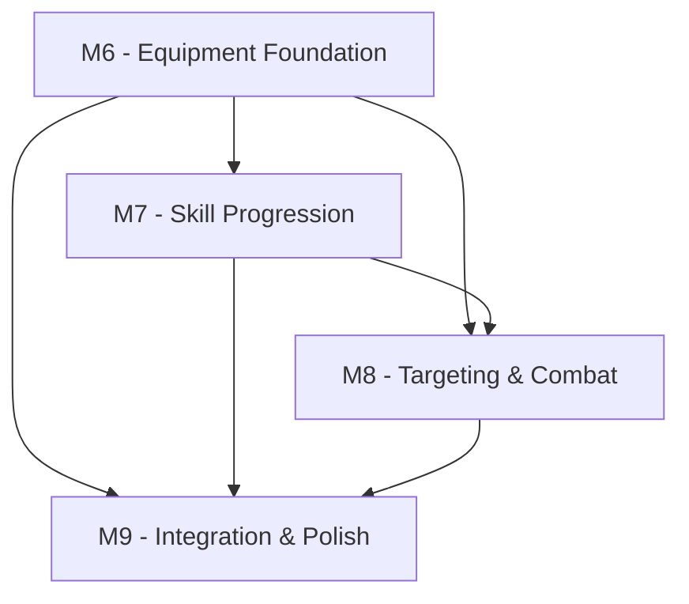

# GitHub Issues for Post-MVP Milestones (US-002 Workshop Outcomes)

This document outlines the GitHub issues that should be created based on the US-002 Roadmap Alignment Workshop outcomes. These issues implement the "Meaningful Loadouts" design pillar through M6-M9 milestones.

## Issue 1: M6 - Equipment Foundation System

**Title**: M6 - Equipment Foundation System Implementation  
**Labels**: milestone, equipment, backend, high-priority  
**Milestone**: M6 - Equipment Foundation  
**Estimate**: 5 points  

### Summary
Implement the core equipment system foundation including equipment slots, basic equip/unequip operations, stat effects, and database persistence. This is the foundational system for the "Meaningful Loadouts" design pillar.

### Acceptance Criteria
- [ ] Database schema created for equipment slots and item templates
- [ ] Basic equip/unequip operations functional via API
- [ ] Equipment slots: hands (main_hand, off_hand), armor (chest, legs, feet)
- [ ] Simple stat effects applied when equipment changes
- [ ] Equipment state persists through player reconnect
- [ ] Equipment cooldown system prevents immediate re-equipping
- [ ] Weight/bulk encumbrance calculations affect movement
- [ ] Server-side validation for equipment slot compatibility

### Technical Requirements
- Extend database with `equipment_slots` and `item_templates` tables
- Implement equipment validation in sim service
- Add equipment messages to WebSocket protocol
- Create equipment persistence in join/reconnect flow

### Testing Notes
- Unit tests for equipment slot validation and stat calculations
- Integration tests for equip/unequip operations via WebSocket
- Performance tests for encumbrance calculations under load

### Dependencies
- None (foundation system)

### Related Docs
- [Technical Design Document](../../architecture/technical-design-document.md) - Equipment System section
- [Game Design Document](../../product/vision/game-design-document.md) - Meaningful Loadouts pillar

---

## Issue 2: M7 - Skill Progression System

**Title**: M7 - Skill Progression and XP Pipeline Implementation  
**Labels**: milestone, skills, backend, high-priority  
**Milestone**: M7 - Skill Progression  
**Estimate**: 4 points  

### Summary
Implement skill progression system with XP pipeline, skill requirements for equipment, and stanza unlocking framework. Builds on M6 equipment system to enable skill-gated gear.

### Acceptance Criteria
- [ ] XP events generated from validated player actions
- [ ] Skill progression with rank advancement and notifications
- [ ] Skill requirements block unauthorized equipment use
- [ ] Stanza unlocking system with unlock notifications
- [ ] Skill progression persists through reconnect
- [ ] Skill points banking and spending system
- [ ] Equipment validation checks skill requirements server-side

### Technical Requirements
- Implement XP event pipeline and batching system
- Create skill validation for equipment interactions
- Add skill progression messages to WebSocket protocol
- Extend persistence for skill lines and progression data

### Testing Notes
- Unit tests for XP calculation and skill requirement validation
- Integration tests for skill progression through equipment use
- Test skill gating prevents unauthorized equipment use

### Dependencies
- **M6 Equipment Foundation** - Required for skill-gated equipment

### Related Docs
- [Technical Design Document](../../architecture/technical-design-document.md) - Skill Progression section
- [VRTM](../traceability/VRTM.md) - Skill progression gaps

---

## Issue 3: M8 - Targeting and Combat Resolution

**Title**: M8 - Targeting System and Combat Resolution Implementation  
**Labels**: milestone, combat, targeting, backend, high-priority  
**Milestone**: M8 - Targeting & Combat  
**Estimate**: 5 points  

### Summary
Implement targeting system with difficulty display and basic combat resolution using damage types. Integrates with equipment stats from M6 and skill requirements from M7.

### Acceptance Criteria
- [ ] Tab targeting with server-side validation and line-of-sight
- [ ] Target difficulty color coding based on level bands
- [ ] Combat resolution with damage type calculations
- [ ] Equipment stats affect combat damage and mitigation
- [ ] Target metadata panel with difficulty and status information
- [ ] Basic damage types: slash, pierce, blunt with mitigation
- [ ] Combat results integrated with XP pipeline

### Technical Requirements
- Implement target selection and validation system
- Create damage type calculation and mitigation system
- Add targeting and combat messages to WebSocket protocol
- Integrate equipment stats into combat calculations

### Testing Notes
- Unit tests for damage type calculations and equipment stat integration
- Integration tests for targeting and combat flow
- Performance tests for combat resolution under multiple entities

### Dependencies
- **M6 Equipment Foundation** - Required for equipment stats in combat
- **M7 Skill Progression** - Required for skill-based combat effectiveness

### Related Docs
- [Game Design Document](../../product/vision/game-design-document.md) - Targeting user stories
- [Technical Design Document](../../architecture/technical-design-document.md) - Combat system design

---

## Issue 4: M9 - Integration and Polish

**Title**: M9 - Integration, UI Polish, and Performance Optimization  
**Labels**: milestone, integration, ui, performance, medium-priority  
**Milestone**: M9 - Integration & Polish  
**Estimate**: 3 points  

### Summary
Final integration phase combining equipment, skills, and combat systems with UI improvements and performance optimization. Ensures all post-MVP systems work cohesively.

### Acceptance Criteria
- [ ] Full inventory UI integration with drag-drop functionality
- [ ] Performance optimization maintains 20Hz tick rate under equipment load
- [ ] Integration testing for all equipment/skill/combat workflows
- [ ] User experience testing validates inventory and equipment management
- [ ] All post-MVP user stories from GDD functional
- [ ] Performance metrics collection for equipment system impact
- [ ] Bug fixes and stability improvements across all new systems

### Technical Requirements
- UI integration for inventory management
- Performance profiling and optimization
- Comprehensive integration testing
- User experience validation

### Testing Notes
- End-to-end testing of complete equipment/skill/combat workflows
- Performance testing under realistic equipment load scenarios
- User experience testing for inventory and equipment management

### Dependencies
- **M6 Equipment Foundation** - Core system completed
- **M7 Skill Progression** - Skills integration completed  
- **M8 Targeting & Combat** - Combat system completed

### Related Docs
- [Developer Guide](../../development/developer-guide.md) - Performance testing procedures
- [Roadmap](../../product/roadmap/roadmap.md) - Success metrics for M9

---

## Issue Creation Checklist

When creating these issues in GitHub:

- [ ] Create M6 issue with equipment foundation details
- [ ] Create M7 issue with skill progression details  
- [ ] Create M8 issue with targeting and combat details
- [ ] Create M9 issue with integration and polish details
- [ ] Link all issues to US-002 roadmap alignment workshop
- [ ] Assign appropriate milestones and labels
- [ ] Add issues to project board for tracking
- [ ] Link issues in VRTM.md gap analysis section
- [ ] Update roadmap.md with issue references

## Cross-Issue Dependencies

The dependency chain ensures equipment foundation is stable before skills and combat depend on it, and all systems are integrated in the final M9 phase.