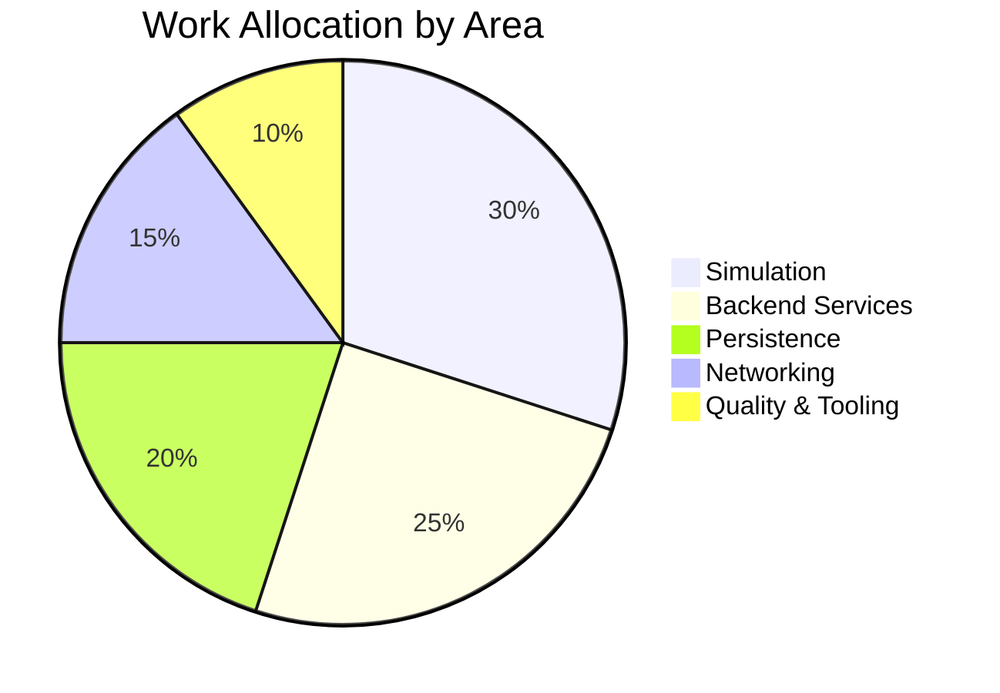

# Project Roadmap Handbook

This document is the living source of truth for roadmap communication. Update it whenever the team revises release scope, cadence, or risk posture. Keep the language evergreen by focusing on the current release theme and the evidence that supports each status call.

## How to Use This File
- **Before planning cycles**: refresh the release theme, target horizon, and the date of the most recent update.
- **During reviews**: adjust the timeline, status tables, and risk register based on the latest decisions.
- **After major shifts**: cross-check links to the [Technical Design Document](../../architecture/technical-design-document.md), [Game Design Document](../vision/game-design-document.md), developer workflows, and open issues so readers can dive deeper.

## Current Release Overview
- **Release Theme**: _Describe the value delivered during this horizon._
- **Time Horizon**: _Number of weeks or sprints covered._
- **Last Updated**: _YYYY-MM-DD_ (ensure this date reflects reality).

### Timeline Template
Update the milestone labels and durations so they mirror the plan settled during roadmap sessions. Keep the chart short enough to fit on common GitHub viewports.

```mermaid
gantt
    title Prototype Game – <Theme or Codename>
    dateFormat  YYYY-MM-DD
    axisFormat  %W

    section Milestone A
    Discovery & Design     :milestone, mA-start, <start>, 0d
    Implementation Slice   :active,  mA-dev,   after mA-start, <duration>
    Validation             :milestone, mA-done, after mA-dev, 0d

    section Milestone B
    Planning               :milestone, mB-start, after mA-done, 0d
    Build & Integration    :mB-dev, after mB-start, <duration>
    Launch Readiness       :milestone, mB-done, after mB-dev, 0d

    section Stretch / Hardening
    Observability & Ops    :mOps, after mB-start, <duration>
    Stretch Goal           :mStretch, after mB-done, <duration>
```

### Work Allocation Snapshot
Maintain a high-level effort split to communicate where engineering time is invested. Adjust the slices whenever priorities shift.



## Status by Capability
Replace the example rows with the current focus areas, progress, and next steps. Keep the table scoped to the work planned for this release.

| Area | Status | Progress | Current Focus | Next Steps |
|------|--------|----------|---------------|------------|
| Local Sharding | ✅ Green | 100% | Stable AOI & handovers | Monitor performance budget |
| Inventory & Equipment | 🟡 Amber | 60% | Encumbrance tuning | Ship equip cooldown telemetry |
| Targeting & Skills | 🟡 Amber | 40% | Ability unlock UX | Harden XP pipeline |
| Persistence | 🔴 Red | 10% | Schema validation | Prototype reconnect path |
| Observability | ✅ Green | 90% | Metrics dashboards | Add reconnect SLO |

### Technical Health Checklist
Summarize proof that the roadmap is grounded in reality. Link to supporting documents.

- **Simulation performance**: Capture measurements from the latest load tests or soak runs and attach links or summaries here.
- **Testing coverage**: Review [`development/server-feature-test-plan.md`](../../development/server-feature-test-plan.md) before marking capabilities green.
- **Design alignment**: Cross-reference the [Technical Design Document](../../architecture/technical-design-document.md) for milestone acceptance criteria.

## Risks & Mitigations
Track the top risks that could de-rail the release. When a risk resolves, move it to the retrospective notes for traceability.

| Category | Risk | Probability | Impact | Mitigation | Owner |
|----------|------|-------------|--------|------------|-------|
| Technical | Database reconnect exceeds 2s budget | Medium | High | Prototype streaming resume early and measure | Backend |
| Capacity | Team bandwidth during holidays | Medium | Medium | Pull forward test automation, adjust scope | PO |
| Integration | Copilot-generated code drift | Low | Medium | Enforce `.llm/AGENTS.md` rituals and targeted reviews | Tech Lead |

## Success Metrics
Document the metrics that prove the release theme is met. Update values as teams report progress.

- **Reconnect latency**: < 2 seconds P95.
- **Bot density**: ±20% of target with no oscillation.
- **Client experience**: 90% of ability casts resolve within 300 ms of target confirmation.
- **Documentation freshness**: Roadmap updated within two business days of each planning meeting.

## Future Phases
Capture upcoming horizons so stakeholders understand what happens after the current release ships. Keep descriptions succinct and value oriented.

- **Phase B – Distributed Sharding**: Multi-node ownership, cross-node handover protocol, auto-scaling policy.
- **Phase C – Advanced Combat**: Expanded ability library, cooperative play loops, combat logging.
- **Phase D – Platform Readiness**: Regional sharding strategy, observability hardening, client platform expansion.

## Collaboration Rituals
- **Roadmap Meeting**: Follow the [meeting guide](meeting-guide.md) and log outcomes using the [update template](update-template.md).
- **Implementation Planning**: Use the [implementation playbook](implementation-playbook.md) to translate milestones into executable work.
- **Release Readiness**: Score the release with the [readiness template](../release/release-readiness-template.md) before go/no-go calls.

Revisit this handbook whenever stakeholders need to understand "what is happening next". Keeping it current prevents stale status narratives and anchors the roadmap to objective evidence.
