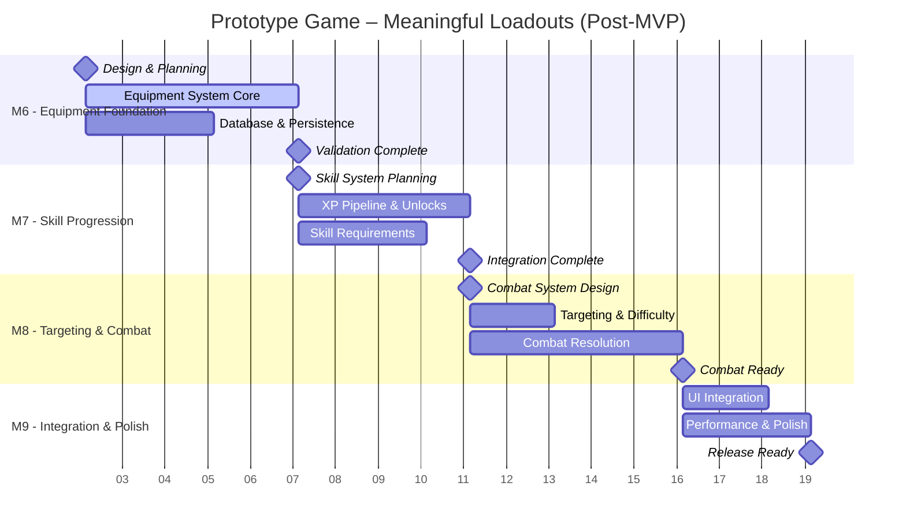
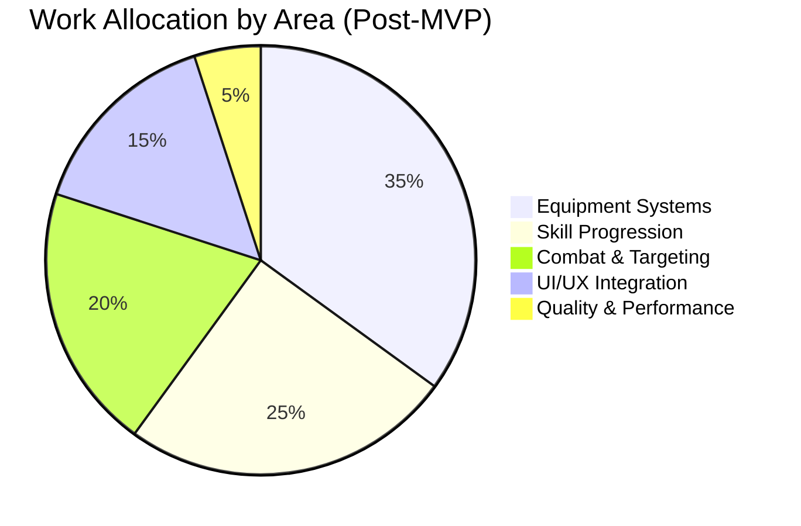

# Project Roadmap Handbook

This document is the living source of truth for roadmap communication. Update it whenever the team revises release scope, cadence, or risk posture. Keep the language evergreen by focusing on the current release theme and the evidence that supports each status call.

## How to Use This File
- **Before planning cycles**: refresh the release theme, target horizon, and the date of the most recent update.
- **During reviews**: adjust the timeline, status tables, and risk register based on the latest decisions.
- **After major shifts**: cross-check links to the [Technical Design Document](../../architecture/technical-design-document.md), [Game Design Document](../vision/game-design-document.md), developer workflows, and open issues so readers can dive deeper.

## Current Release Overview
- **Release Theme**: Meaningful Loadouts - Equipment & Progression Foundation
- **Time Horizon**: 13-17 weeks (M6-M9 milestone sequence)
- **Last Updated**: 2025-01-15 (Post US-002 Roadmap Alignment Workshop)

**Post-MVP Focus**: Implementation of the "Meaningful Loadouts" design pillar through equipment systems, skill progression, targeting, and combat resolution. This represents the foundation for character progression and gear-based gameplay.

### Timeline Template
Updated milestone structure based on US-002 roadmap alignment workshop outcomes:

### Work Allocation Snapshot
Updated allocation reflecting post-MVP equipment and progression focus:

## Status by Capability
Current status based on US-002 roadmap alignment workshop outcomes. All MVP milestones (M0-M5) completed successfully.

| Area | Status | Progress | Current Focus | Next Steps |
|------|--------|----------|---------------|------------|
| Local Sharding (M3) | ✅ Green | 100% | Stable AOI & handovers | Monitor performance under equipment load |
| Bot Density (M4) | ✅ Green | 100% | Population management | Maintain stability during equipment testing |
| Persistence (M5) | ✅ Green | 100% | Position & basic state | Extend schema for equipment/skills (M6) |
| Equipment System (M6) | 🔴 Red | 0% | Planning phase | Design database schema, begin implementation |
| Skill Progression (M7) | 🔴 Red | 0% | Blocked by M6 | Wait for equipment foundation |
| Targeting & Combat (M8) | 🔴 Red | 0% | Blocked by M6-M7 | Design targeting UI during M6 |
| Integration & Polish (M9) | 🔴 Red | 0% | Future planning | UI/UX design for inventory systems |

### Technical Health Checklist
Summarize proof that the roadmap is grounded in reality. Link to supporting documents.

- **Simulation performance**: Capture measurements from the latest load tests or soak runs and attach links or summaries here.
- **Testing coverage**: Review [`development/server-feature-test-plan.md`](../../development/server-feature-test-plan.md) before marking capabilities green.
- **Design alignment**: Cross-reference the [Technical Design Document](../../architecture/technical-design-document.md) for milestone acceptance criteria.

## Risks & Mitigations
Updated risk register based on US-002 roadmap alignment workshop analysis.

| Category | Risk | Probability | Impact | Mitigation | Owner |
|----------|------|-------------|--------|------------|-------|
| Technical | Equipment-Skill system complexity | High | High | Phase delivery: equipment foundation first (M6), then skills (M7) | Tech Lead |
| Performance | Encumbrance calculations impact tick budget | Medium | High | Early performance testing with synthetic equipment data during M6 | Backend Team |
| Integration | UI/UX complexity for inventory systems | Medium | Medium | Early prototype during M6, user testing before M9 | Frontend Team |
| Resource | Team bandwidth for 13-17 week timeline | Medium | Medium | Phased milestone approach allows for adjustment between M6-M9 | PO |
| Technical | Combat system complexity with damage types | Medium | High | Reuse existing simulation patterns, incremental testing in M8 | Backend Team |

## Success Metrics
Success criteria for the "Meaningful Loadouts" release theme based on US-002 workshop outcomes.

**M6 - Equipment Foundation Success**:
- Equipment slots (hands, armor) functional with equip/unequip operations
- Basic stat effects visible and applied correctly
- Equipment persistence through reconnect < 2 seconds
- Database schema handles equipment without performance degradation

**M7 - Skill Progression Success**:
- XP pipeline awards experience for validated actions
- Skill requirements prevent unauthorized equipment use 
- Stanza unlocking system functional with notifications
- Skill progression persists through reconnect

**M8 - Targeting & Combat Success**:
- Tab targeting with difficulty color display functional
- Combat resolution applies damage types correctly
- Equipment stats affect combat calculations
- 90% of ability casts resolve within 300ms

**M9 - Integration Success**:
- Full inventory UI integration with drag-drop functionality
- Performance maintains 20Hz tick rate under equipment load
- User experience testing validates loadout management workflow
- All post-MVP user stories from GDD functional

**Overall Release Success**:
- **Equipment Impact**: Players can equip items and see immediate stat changes
- **Progression Feel**: Skill advancement unlocks new equipment options
- **Combat Clarity**: Target difficulty and combat resolution are transparent
- **Performance**: All systems maintain MVP performance targets

## Future Phases
Capture upcoming horizons so stakeholders understand what happens after the current release ships. Keep descriptions succinct and value oriented.

- **Phase B – Distributed Sharding**: Multi-node ownership, cross-node handover protocol, auto-scaling policy.
- **Phase C – Advanced Combat**: Expanded ability library, cooperative play loops, combat logging.
- **Phase D – Platform Readiness**: Regional sharding strategy, observability hardening, client platform expansion.

## Collaboration Rituals
- **Roadmap Meeting**: Follow the [meeting guide](meeting-guide.md) and log outcomes using the [update template](update-template.md).
- **Implementation Planning**: Use the [implementation playbook](implementation-playbook.md) to translate milestones into executable work.
- **Release Readiness**: Score the release with the [readiness template](../release/release-readiness-template.md) before go/no-go calls.

Revisit this handbook whenever stakeholders need to understand "what is happening next". Keeping it current prevents stale status narratives and anchors the roadmap to objective evidence.
