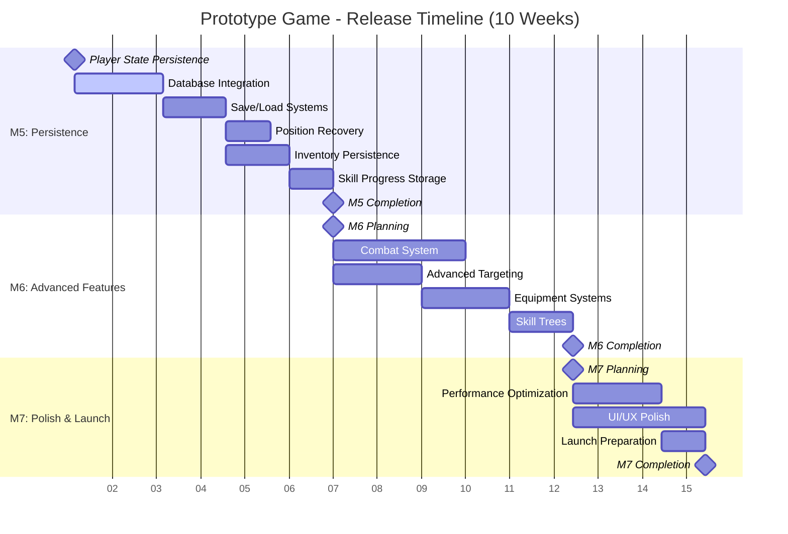
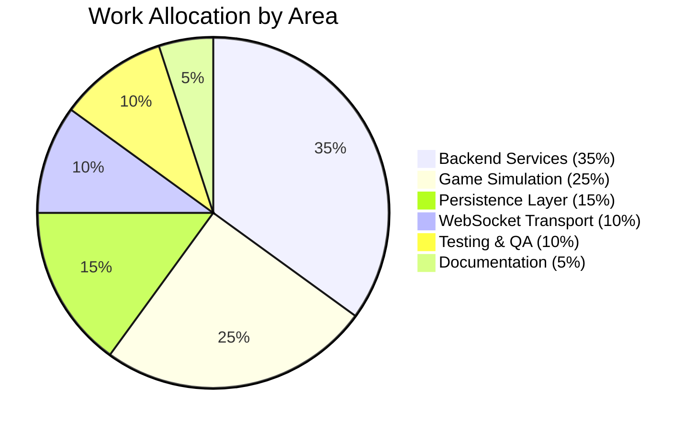

# Project Roadmap

This document provides a comprehensive visualization of the prototype-game project roadmap, including current milestones, work allocation, status updates, and risk assessments.

## 📅 Current Release Timeline (10 Weeks)

The following Gantt chart shows our current release timeline spanning 10 weeks with three major milestones (M5, M6, M7):

## 📊 Planned Work Allocation

The following pie chart shows the distribution of development effort across different areas:

## 📋 Status Snapshot by Area

| Area | Status | Progress | Current Focus | Next Steps |
|------|--------|----------|---------------|------------|
| **Simulation/AOI** | ✅ Complete | 100% | M3 handover working | Move to M4 bot density |
| **WebSocket Transport** | ✅ Complete | 100% | WS endpoints functional | Optimization for scale |
| **Authentication** | ✅ Complete | 100% | Gateway/sim integration | Session persistence |
| **Persistence Layer** | 🔄 In Progress | 25% | Database design | M5 implementation |
| **Inventory/Equipment** | 📋 Planned | 0% | Spec review | M6 implementation |
| **Combat Systems** | 📋 Planned | 0% | Design phase | M6 stanza system |
| **Bot Behavior** | 📋 Planned | 0% | M4 density targets | Wandering AI |
| **Performance** | 🔄 Ongoing | 75% | 20Hz tick stable | Load testing |
| **Testing Infrastructure** | ✅ Strong | 90% | Unit/integration tests | E2E automation |

## 🔗 Key Issues and Links

### Current Milestones
| Milestone | Description | Target | Status | GitHub Link |
|-----------|-------------|--------|--------|-------------|
| M0 | Project skeleton | ✅ Complete | Done | [TDD.md#M0](../design/TDD.md#mvp-milestones--acceptance-criteria) |
| M1 | Presence & Movement | ✅ Complete | Done | [TDD.md#M1](../design/TDD.md#mvp-milestones--acceptance-criteria) |
| M2 | Interest Management | ✅ Complete | Done | [TDD.md#M2](../design/TDD.md#mvp-milestones--acceptance-criteria) |
| M3 | Local Sharding | ✅ Complete | Done | [TDD.md#M3](../design/TDD.md#mvp-milestones--acceptance-criteria) |
| M4 | Bots & Density | 🔄 In Progress | 40% | [TDD.md#M4](../design/TDD.md#mvp-milestones--acceptance-criteria) |
| M5 | Persistence | 📋 Next | 0% | [TDD.md#M5](../design/TDD.md#mvp-milestones--acceptance-criteria) |

### Related Documentation
| Document | Purpose | Status | Link |
|----------|---------|--------|------|
| Game Design Document | Vision & scope | ✅ Current | [GDD.md](../design/GDD.md) |
| Technical Design Document | Architecture & milestones | ✅ Current | [TDD.md](../design/TDD.md) |
| Developer Guide | Build, run, test procedures | ✅ Current | [DEV.md](../dev/DEV.md) |
| Feature Proposal Process | Change management | ✅ Current | [FEATURE_PROPOSAL.md](../process/FEATURE_PROPOSAL.md) |

### GitHub Project Integration
- **Main Project Board**: [Game Roadmap Project](https://github.com/users/AstroSteveo/projects/2) <!-- Ensure this project board exists, or remove this link if not available. -->
- **Issue Templates**: <!-- Ensure roadmap planning template exists at .github/ISSUE_TEMPLATE/roadmap.yml, or update/remove this link. -->
- **Roadmap Meetings**: <!-- Ensure meeting guide exists at ../process/ROADMAP_MEETINGS.md, or update/remove this link. -->

## ⚠️ Risks and Mitigations

| Risk Category | Risk Description | Probability | Impact | Mitigation Strategy | Owner |
|---------------|------------------|-------------|--------|-------------------|-------|
| **Technical** | Cross-node handover complexity | Medium | High | Keep Phase A in-process; defer until stable | Tech Lead |
| **Performance** | Bandwidth spikes under load | Medium | Medium | Snapshot cadence caps; coarse delta until binary codec | Backend Team |
| **Scalability** | Bot density causing load skew | Low | Medium | Bot budgets per cell; simple caps to avoid stampedes | Gameplay Team |
| **Integration** | WebSocket transport stability | Low | High | Comprehensive testing with `-tags ws`; fallback to HTTP | Network Team |
| **Persistence** | Data consistency during handovers | Medium | High | Atomic state transitions; rollback mechanisms | Database Team |
| **Timeline** | M5 persistence complexity | Medium | Medium | Early prototyping; incremental delivery | Project Lead |

## 🎯 Success Metrics

### Performance Targets (MVP)
- **Tick Rate**: 20 Hz sustained with <25ms server tick at 200 entities
- **Handover Latency**: <250ms for local handover, <500ms for cross-node
- **Bandwidth**: <30KB/s per client average, spikes <100KB/s
- **Connection Handling**: Support 200+ concurrent WebSocket connections

### Quality Gates
- **Test Coverage**: >80% for core simulation logic
- **Build Health**: All CI checks pass (fmt, vet, test, test-ws)
- **Documentation**: All new features documented with examples
- **Performance**: No regressions in benchmark suite

## 🚀 Future Phases (Post-M7)

### Phase B: Distributed Sharding
- Multi-node cell ownership
- Cross-node handover implementation
- Distributed state management
- Load balancing and service discovery

### Phase C: Advanced Features
- Player-to-player interactions
- Advanced combat mechanics
- Guild and social systems
- Economy and trading

### Phase D: Scale & Polish
- Global deployment
- Advanced analytics
- Mobile client support
- Community features

## 📚 How to Use This Roadmap

### For Contributors
1. **Check current milestone status** in the status table above
2. **Review relevant design documents** linked in the key issues section
3. **Follow development procedures** outlined in [DEV.md](../dev/DEV.md)
4. **Submit feature proposals** using the [process guide](../process/FEATURE_PROPOSAL.md)

### For Project Planning
1. **Regular reviews**: Update this document during roadmap meetings
2. **Status tracking**: Maintain progress percentages and status indicators
3. **Risk management**: Review and update risk assessments monthly
4. **Milestone planning**: Use this roadmap for sprint and release planning

### For Stakeholders
1. **Executive summary**: Focus on the Gantt chart and work allocation pie chart
2. **Progress tracking**: Monitor the status snapshot table for overall health
3. **Risk awareness**: Review risks and mitigations for decision making
4. **Timeline awareness**: Use milestone targets for external planning

---

**Last Updated**: January 2024  
**Next Review**: End of current sprint  
**Document Owner**: Technical Architect  
**Stakeholders**: Product Owner, Development Team, QA/SRE