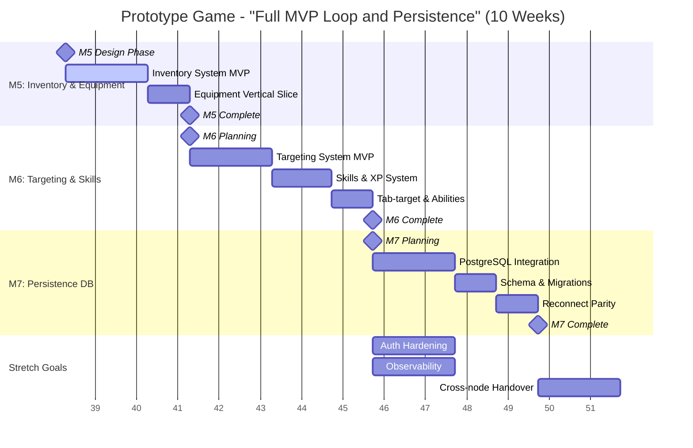
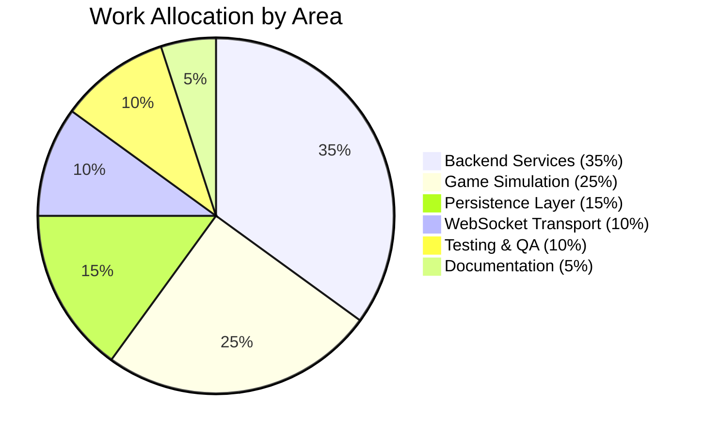

# Project Roadmap

This document provides a comprehensive visualization of the prototype-game project roadmap, including current milestones, work allocation, status updates, and risk assessments.

## 📅 Current Release Timeline (10 Weeks) - Updated Sept 2025

**Release Theme**: "Full MVP Loop and Persistence"

The following Gantt chart shows our updated release timeline based on roadmap planning (2025-09-16):

## 📊 Planned Work Allocation

The following pie chart shows the distribution of development effort across different areas:

## 📋 Status Snapshot by Area (Updated Sept 16, 2025)

Based on roadmap planning meeting outcomes:

| Area | Status | Progress | Current Focus | Next Steps |
|------|--------|----------|---------------|------------|
| **Local Sharding (M3)** | ✅ Complete | 100% | AOI streaming & handover functional | Move to M4 bot density |
| **Bots & Density (M4)** | ✅ Complete | 100% | Min density targeting achieved | Finalize wander behavior |
| **WebSocket Transport** | ✅ Complete | 100% | Stable at 200 entities/cell | Performance optimization |
| **Authentication** | ✅ Complete | 100% | Gateway/sim integration stable | Hardening for production |
| **Inventory/Equipment** | 📋 Next (M5) | 0% | MVP vertical slice design | Week 2: Design complete |
| **Targeting & Skills** | 📋 Planned (M6) | 0% | Tab-target & XP system design | Week 4: Development start |
| **Persistence Layer** | 📋 Planned (M7) | 0% | PostgreSQL/Redis integration | Week 6: Implementation |
| **Performance** | ✅ Strong | 90% | 20Hz tick stable, <250ms handover | Load testing under density |
| **Technical Debt** | 🔄 Ongoing | 60% | Inventory/equipment, targeting, DB | Address in M5-M7 features |
| **Testing Infrastructure** | ✅ Strong | 90% | Unit/integration coverage good | E2E automation for persistence |

### Technical Health Assessment
- **Simulation**: AOI streaming and multi-cell handover functional, handover latency <250ms ✅
- **Bot Density**: Spawning/despawning maintains min density, ±20% tuning achieved ✅  
- **Scale Target**: 200 entities/cell stable ✅
- **Outstanding**: Persistence layer, cross-node handover prep, technical debt reduction

## 🔗 Key Issues and Links

### Current Milestones (Updated Sept 2025)
| Milestone | Description | Target | Status | GitHub Link |
|-----------|-------------|--------|--------|-------------|
| M0 | Project skeleton | ✅ Complete | Done | [TDD.md#M0](../design/TDD.md#mvp-milestones--acceptance-criteria) |
| M1 | Presence & Movement | ✅ Complete | Done | [TDD.md#M1](../design/TDD.md#mvp-milestones--acceptance-criteria) |
| M2 | Interest Management | ✅ Complete | Done | [TDD.md#M2](../design/TDD.md#mvp-milestones--acceptance-criteria) |
| M3 | Local Sharding | ✅ Complete | Done | [TDD.md#M3](../design/TDD.md#mvp-milestones--acceptance-criteria) |
| M4 | Bots & Density | ✅ Complete | Done | [TDD.md#M4](../design/TDD.md#mvp-milestones--acceptance-criteria) |
| M5 | Inventory & Equipment MVP | 🔄 Week 2 Start | 0% | [TDD.md#M5](../design/TDD.md#mvp-milestones--acceptance-criteria) |
| M6 | Targeting & Skills MVP | 📋 Week 4 Start | 0% | [TDD.md#M6](../design/TDD.md#mvp-milestones--acceptance-criteria) |
| M7 | Persistence DB Integration | 📋 Week 6 Start | 0% | [TDD.md#M7](../design/TDD.md#mvp-milestones--acceptance-criteria) |

### Related Documentation
| Document | Purpose | Status | Link |
|----------|---------|--------|------|
| Game Design Document | Vision & scope | ✅ Current | [GDD.md](../design/GDD.md) |
| Technical Design Document | Architecture & milestones | ✅ Current | [TDD.md](../design/TDD.md) |
| Developer Guide | Build, run, test procedures | ✅ Current | [DEV.md](../dev/DEV.md) |
| Feature Proposal Process | Change management | ✅ Current | [FEATURE_PROPOSAL.md](../process/FEATURE_PROPOSAL.md) |

### GitHub Project Integration
- **Main Project Board**: [Game Roadmap Project](https://github.com/users/AstroSteveo/projects/2) <!-- Ensure this project board exists, or remove this link if not available. -->
- **Issue Templates**: <!-- Ensure roadmap planning template exists at .github/ISSUE_TEMPLATE/roadmap.yml, or update/remove this link. -->
- **Roadmap Meetings**: <!-- Ensure meeting guide exists at ../process/ROADMAP_MEETINGS.md, or update/remove this link. -->

## ⚠️ Risks and Mitigations (Updated Sept 2025)

Based on roadmap planning meeting outcomes:

| Risk Category | Risk Description | Probability | Impact | Mitigation Strategy | Owner |
|---------------|------------------|-------------|--------|-------------------|-------|
| **Technical** | DB schema/migrations complexity | Medium | High | Technical design sessions for DB/inventory/skills | Tech Lead |
| **Capacity** | Team capacity for inventory/equipment feature | Medium | Medium | Schedule buffer time; prioritize MVP acceptance criteria | Project Lead |
| **Integration** | PostgreSQL setup for dev and CI | Medium | Medium | Early prototyping; dev environment parity | DevOps |
| **Performance** | Persistence layer latency impact | Low | High | <2s reconnect budget; Redis caching strategy | Backend Team |
| **Scope** | Feature creep in vertical slices | Medium | Medium | Strict MVP acceptance criteria; defer stretch goals | Product Owner |
| **Timeline** | 10-week delivery timeline | Medium | High | Incremental delivery; technical design up-front | All Teams |

### New Mitigation Actions
- **Week 0-1**: Schedule technical design sessions for DB/inventory/skills
- **Week 1**: Complete PostgreSQL setup for dev and CI environments  
- **Week 2**: Define strict MVP acceptance criteria for M5-M7
- **Ongoing**: Monitor team capacity; adjust scope before timeline

## 🎯 Success Metrics (Updated Sept 2025)

### Release Success Criteria - "Full MVP Loop and Persistence"
Based on roadmap planning meeting outcomes:

**M5 Success Metrics:**
- **Inventory System**: Full vertical slice with bag capacity, encumbrance, item templates
- **Equipment System**: Slot-based equipping with cooldowns and skill requirements
- **UI Integration**: Inventory and equipment reflected in client interface

**M6 Success Metrics:**  
- **Targeting**: Tab-target system with soft lock functionality
- **Skills System**: XP gain, skill progression, ability unlocks working
- **Combat Loop**: Basic ability use integrating targeting + skills + equipment

**M7 Success Metrics:**
- **Reconnect Performance**: Position/loadout/skills restore in <2s
- **Data Persistence**: PostgreSQL integration with schema migrations
- **Reconnect Parity**: Full state restoration matching pre-disconnect

### Performance Targets (MVP)
- **Tick Rate**: 20 Hz sustained with <25ms server tick at 200 entities ✅
- **Handover Latency**: <250ms for local handover, <500ms for cross-node ✅
- **Reconnect Time**: <2s for full state restoration (NEW TARGET)
- **Bandwidth**: <30KB/s per client average, spikes <100KB/s
- **Connection Handling**: Support 200+ concurrent WebSocket connections ✅

### Quality Gates
- **Test Coverage**: >80% for core simulation logic
- **Build Health**: All CI checks pass (fmt, vet, test, test-ws)
- **Documentation**: All new features documented with examples
- **Performance**: No regressions in benchmark suite

## 🚀 Future Phases (Post-M7)

### Phase B: Distributed Sharding
- Multi-node cell ownership
- Cross-node handover implementation
- Distributed state management
- Load balancing and service discovery

### Phase C: Advanced Features
- Player-to-player interactions
- Advanced combat mechanics
- Guild and social systems
- Economy and trading

### Phase D: Scale & Polish
- Global deployment
- Advanced analytics
- Mobile client support
- Community features

## 📚 How to Use This Roadmap

### For Contributors
1. **Check current milestone status** in the status table above
2. **Review relevant design documents** linked in the key issues section
3. **Follow development procedures** outlined in [DEV.md](../dev/DEV.md)
4. **Submit feature proposals** using the [process guide](../process/FEATURE_PROPOSAL.md)

### For Project Planning
1. **Regular reviews**: Update this document during roadmap meetings
2. **Status tracking**: Maintain progress percentages and status indicators
3. **Risk management**: Review and update risk assessments monthly
4. **Milestone planning**: Use this roadmap for sprint and release planning

### For Stakeholders
1. **Executive summary**: Focus on the Gantt chart and work allocation pie chart
2. **Progress tracking**: Monitor the status snapshot table for overall health
3. **Risk awareness**: Review risks and mitigations for decision making
4. **Timeline awareness**: Use milestone targets for external planning

---

**Last Updated**: September 16, 2025 (Roadmap Planning Meeting)  
**Next Review**: End of Week 2 (M5 Design Phase)  
**Document Owner**: Technical Architect  
**Stakeholders**: Product Owner, Development Team, QA/SRE  
**Source**: [Issue #109 - Roadmap Planning Meeting](https://github.com/AstroSteveo/prototype-game/issues/109)